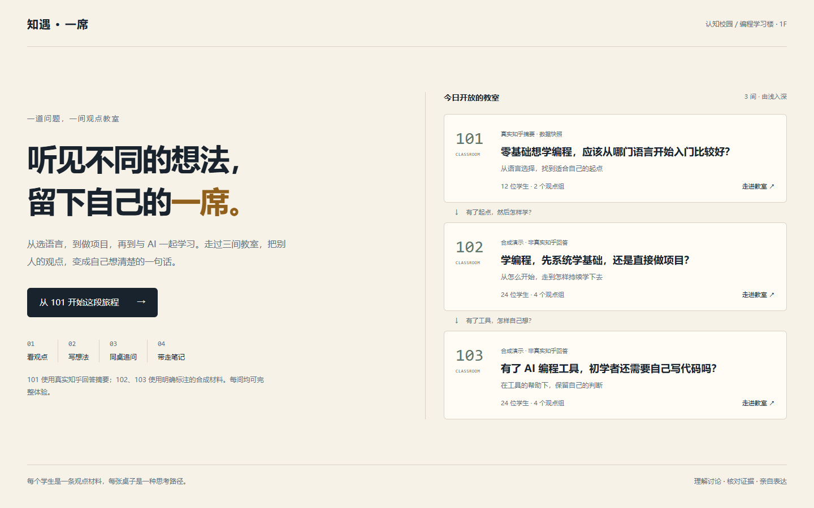
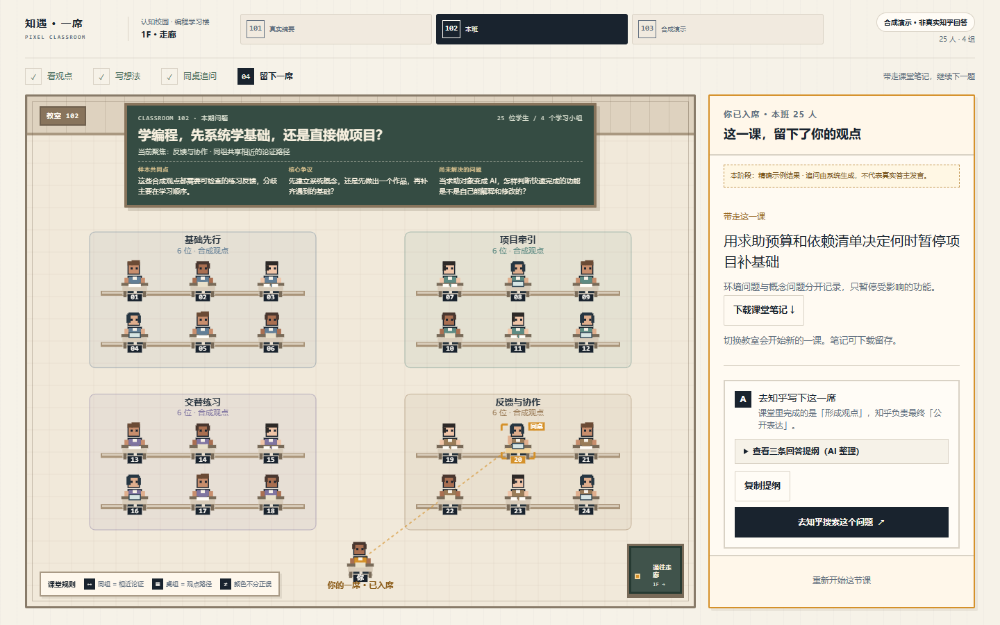

# 知遇·一席
## 产品说明计划书

**一道问题，一间教室；理解别人，再留下自己的表达。**

知乎黑客松 2026 · 校园新锐季　｜　知识炼金场

团队：知乎有你一席　｜　队长：杨骐瑞　｜　湖北师范大学

**3 间完整教室 · 12 条真实知乎摘要 + 48 条合成材料**

体验地址：https://zhiyu-yixi.vercel.app

浏览器直接打开，无需账号。先使用示例完成一节课，再带入自己的观点。

版本：2026 年 9 月 15 日 · 三教室参赛版（TASK-026 / TASK-027）

---

# 01　读懂讨论，形成自己的表达

## 看过很多回答，仍说不清自己的理由

面对编程入门这类多元问题，学习者会同时看到不同建议，却难以分清建议背后的目标、条件与经验。让 AI 直接给出完整答案，也不等于自己理解了讨论。

知遇·一席把同题材料组织成可探索的像素课堂：每位学生代表一条材料，桌组表示相近的论证路径。用户先核对别人为什么这样想，再带入自己的观点，接受一次针对性追问，形成可下载的课堂笔记和表达提纲。

## 三间教室串成一段学习旅程

| 教室与问题 | 材料范围 | 本课要想清楚什么 |
|---|---|---|
| 101：先学哪门语言？ | 12 条真实知乎摘要、2 组 | 把目标与试学反馈放进选择条件 |
| 102：补基础还是做项目？ | 24 条合成材料、4 组 | 区分环境问题与知识卡点，制定暂停与补课条件 |
| 103：有 AI 还要自己写代码吗？ | 24 条合成材料、4 组 | 通过解释、修改和独立验证保留自己的判断 |

每间都有独立材料、讨论、示例观点、追问及学习产物，均可完整操作。上一课的未解决问题引向下一间教室。102/103 为明确标注的合成演示，不代表真实知乎讨论或答主立场。

## 面向谁，与知乎如何连接

面向大学生和进入陌生领域的职场新人。101 用知乎真实摘要保留来源关系；用户形成提纲后回到知乎原问题亲自表达。102/103 提供练习材料，出口为相关问题搜索，不伪造原回答链接。

本次已验证功能闭环，尚未通过用户研究证明学习效果、创作质量或社区活跃度提升。

---

# 02　一节课的输入与产出

| 阶段 | 用户操作 | 可核对的结果 |
|---|---|---|
| 看观点 | 点学生或文字列表，听各组 | 材料摘要、理由、来源标记与黑板 |
| 写想法 | 写至少 50 字观点及理由 | 相关性、笔记支持、当前样本覆盖 |
| 找一席 | 查看判断依据与候选位置 | 三项满足时提示当前样本覆盖较少 |
| 同桌追问 | 核对来源，回应一个问题 | 观点、来源与追问绑定；回应参与生成 |
| 整理笔记 | 对照原观点、回应与草稿 | 《我的一席》和三条表达提纲 |
| 带走这一课 | 下载笔记，去知乎或下一题 | 保留表达过程、证据与模式说明 |

**闭环看得见：** 从一个输入，到一次追问，再到可带走的个人产物和下一道问题。切题会开始新的一课，笔记需主动下载，不宣称拥有跨课堂长期记忆。

示例按钮与参考回应均有标记；修改输入后需要重新分析。入席表示参与讨论，不表示系统证明用户已经掌握。

---

# 03　数据和 AI 如何协作

## 两类课堂材料，共用证据约束

**101 准备链：** 知乎官方 API → 同题核验与去重 → 论证抽取 → 本地 BGE 向量 → Ward 层次聚类 → 带版本和校验和的只读 Snapshot。

**102/103 合成课堂：** 预设不同论证、主题分组和示例回应 → 目录隔离 → Zod 与引用校验 → 显式合成展示。合成分组用于演示，未宣称来自真实语料聚类。

**个人学习链（三间共用）：** 当前观点 → 主张和三项判断 → 匹配参考来源与一次追问 → 实际回应 → 笔记、观点草稿和三条提纲。任意输入由 DeepSeek V4 Pro 处理。

模型只选择 evidenceId；服务端从已验证材料或笔记区间解析引文，并核对题目、资料版本及来源关系。合法结构不等于结论正确，页面保留原表达供用户判断。

| 工程层次 | 实现与用途 |
|---|---|
| 页面与服务 | Next.js 16 App Router、React 19、TypeScript；桌面并排与手机上下布局 |
| 合同与生成 | Zod 单一领域 Schema、AI SDK 结构化输出、服务端 Provider 边界 |
| 真实材料处理 | Transformers.js / BGE-small-zh-v1.5，512 维；ml-hclust / Ward 离线聚类 |
| 状态与恢复 | reducer、requestId、取消、25 秒截止、有限重试；失败后保留输入 |
| 追问与回应绑定 | HMAC 签名绑定原观点、题目、资料版本、追问和有效期，拒绝错题结果 |
| 发布与复现 | Vercel、只读 Snapshot、合成目录随代码构建、依赖锁与源码包 |

当前是有明确阶段的 AI 工作流，没有自主多工具循环或多 Agent。像素学生表示材料，课代表是系统归纳，均不冒充真实答主。

---

# 04　真实范围与交付验证

## 12 条真实摘要，48 条明确合成材料

101 采集于北京时间 2026 年 9 月 15 日 01:41。官方返回 15 条回答，排除 2 条偏题和 1 条缺少可提取理由的记录后保留 12 条摘要。未取得全文；作者和互动数量等未提供字段不补造。9+3 两组分离度较低，仅用于探索论证路径。

102 与 103 各有 24 条不同合成材料、4 个预设主题组。每个学生对应一条材料，不复制真实来源凑人数。项目共 60 条材料，不能称为“60 条真实知乎回答”。

| 验证范围 | 结果与边界 |
|---|---|
| 自动化检查 | typecheck、lint、生产 build 通过；66 项单元、合同和集成测试通过 |
| 完整体验 | 3 教室 × 1440×900、1366×768、390×844，共 9 条示例闭环 |
| 产物出口 | 每题实际下载笔记；原观点、回应、提纲和证据齐全；能进入下一题 |
| 操作与恢复 | 键盘、Reduced Motion、Reset、第二次操作、切题清理和晚到响应通过 |
| 故障注入 | 分析、追问准备、回应整理失败后保留输入，Retry 可恢复 |
| 实时调用 | 102 非示例观点完成分析、追问及回应整理；执行为 Live，材料仍为合成 |

102 本机单次真实调用约 5.3 / 4.3 / 7.2 秒，分别对应分析、追问、整理。这是功能验收，不是性能统计。最新公网验收与文件校验清单见参赛包。

## 可信度的三个边界

**有限结论。** 一席只表示当前样本覆盖较少，不证明观点新颖、正确或全知乎没人说过。座次、颜色与人数不代表排名、社会共识或正确率。

**忠实记录。** AI 草稿可与原观点、实际回应对照；用户可以补充条件，也可以保持原观点。

**双重模式。** 课堂区分真实 Snapshot 与合成 Mock；个人执行区分 Live 与精确示例。合成材料上的真实调用不会把材料变成知乎来源。任意输入失败不套固定结果。

---

# 05　场景价值与下一步

## 创新聚焦在理解和参与

把逐条阅读变为可以探索的教室，把个人表达放回同题样本中比较，再用一次有依据的追问连接阅读与表达。三间教室覆盖“选起点—选方法—使用 AI”的连续情境。

101 放大角色、收紧桌组；102/103 展示四组讨论。手机将操作面板置于教室下方，Canvas 同时提供等价文字列表和键盘路径。

应用希望降低有依据地参与社区讨论的门槛。真实摘要保留原问题出口，合成练习披露局限；最终公开表达由人完成。

## 赛后以可评测的 Agent 能力继续发展

| 阶段 | 计划 | 验收方式 |
|---|---|---|
| 第 1 周 | 真实试用与误判样例；参考 nanobot 学习工具、上下文和停止条件 | 固定评测集；有步数与时间上限的只读证据研究 Agent |
| 第 2 周 | 扩展真实备案题，对比全量上下文、向量与混合检索 | 引用有效率、检索命中、延迟和成本对照 |
| 第 3 周 | 可观测性、故障重放和部署复现；按需评估 LangGraph / MCP | 可重放 trace、质量回归与人工核验 |

以上为计划。当前未集成 nanobot、LangGraph、MCP、向量数据库或长期记忆，不将工具清单当作既有能力。

## 体验与运行

Demo：https://zhiyu-yixi.vercel.app

进入任一教室 → 看观点 → 示例观点 → 找到一席 → 认识同桌 → 回应追问 → 核对笔记 → 入席 → 下载 / 知乎出口 / 下一教室。

本机：Node.js 24，npm ci，按 .env.example 配置签名密钥，npm run dev。精确示例无需模型凭证；任意输入需要 DeepSeek。源码包包含锁文件、真实 Snapshot 与合成目录，不含密钥。

个人输入发送给第三方 DeepSeek；应用不写入数据库或日志，仅在当前会话及有界短期缓存中处理。AI 整理可能失真，请核对原意与证据。

依据：本届开发者手册、采集清单、verification/TASK-021 至 TASK-027。技术参考：https://github.com/HKUDS/nanobot
