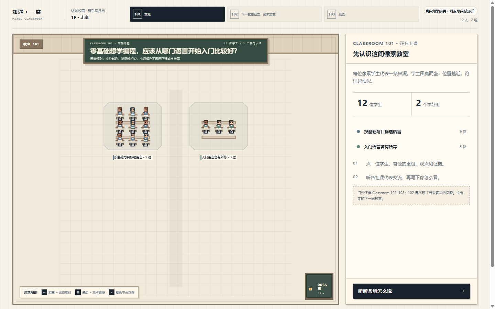

# 知遇·一席
## 产品说明计划书

**一道问题，一间教室；理解别人，再留下自己的表达。**

知乎黑客松 2026 · 校园新锐季

参赛赛道：知识炼金场

团队：知乎有你一席　｜　队长：杨骐瑞　｜　湖北师范大学

体验地址：https://zhiyu-yixi.vercel.app

浏览器直接打开，无需账号。推荐先使用示例完成一节课，再带入自己的观点。

版本：2026 年 9 月 15 日参赛版

---

# 01　要解决的学习问题

## 看过很多回答，仍不知道如何形成自己的表达

面对「零基础学编程先选哪门语言」这类多元问题，学生常同时看到不同建议，却难以分清建议背后的目标、经验和条件。继续追问 AI 得到一段完整答案，也不等于自己已经理解讨论。

知遇·一席把同一问题下的论证结构变成可探索的课堂。每位像素学生表示一条来源，桌组表示相似的论证路径。用户先核对别人的依据，再带入自己的观点，接受一次针对性追问，最后把过程沉淀成自己的表达提纲。

## 为谁服务

面向正在进入陌生领域的大学生和职场新人。首个验证场景是编程入门选择，适用于需要比较条件、权衡路线、准备讨论的学习过程。

## 为什么与知乎契合

知乎提供真实问题、多种解释与原始来源；应用负责把这些材料组织成可比较、可追问的学习体验。最终出口仍回到知乎原问题，由用户亲自完成回答，使内容阅读能够继续连接到有依据的个人表达。

## 本次验证的核心假设

空间化观点对照和一次有针对性的追问，有机会帮助用户说清「我为什么这样想、哪些条件还没想清楚」。本次已验证功能闭环，尚未通过用户研究证明学习效果或创作质量提升。

---

# 02　一节课如何完成

| 环节 | 用户操作 | 产品提供的帮助 |
|---|---|---|
| 看见讨论 | 点击学生或文字列表，查看观点与摘要 | 12 条真实来源按论证路径组织为 2 组，保留原链接 |
| 理解结构 | 听各组课代表，读黑板 | AI 归纳当前样本的共同点、争议和尚未解决的问题 |
| 带入观点 | 写下至少 50 字观点及理由 | 比较相关性、笔记支持、当前样本覆盖，保守判断是否出现一席 |
| 接受追问 | 查看匹配来源，写下一次回应 | 系统依据本次观点和来源提出一个具体问题 |
| 留下表达 | 核对笔记，形成《我的一席》 | 保留原观点、实际回应与 AI 整理草稿，给出三条提纲 |
| 回到社区 | 打开知乎原问题 | 用户亲自完成公开表达，应用不自动发布 |

## 示例中的关键一问

初始观点：用两周试学实验选择编程路线，记录反馈速度、卡点和求助成本，预设继续、缩小项目或补基础的条件。

系统追问：如果反馈慢、卡在环境配置、求助成本高，能否据此认定 Python 不合适，还是应先调整任务与求助方式？

参考回应：先把卡点分为环境、语法和任务拆分三类，排除环境问题、缩小可验证的功能；同类基础错误反复出现再补基础。

这段回应细化了原观点的条件，未必需要改变原观点。系统把过程整理成草稿，并保留原文供核对。示例是明确标记的预计算路径；修改观点或回应后，结果走实时生成。

---

# 03　真实数据与 AI 实现

## 两条处理链，共用同一份证据合同

**课堂准备链：** 知乎官方 API → 同题核验与去重 → 论证抽取 → 本地 BGE 向量 → Ward 层次聚类 → 带版本和校验和的只读 Snapshot。

**个人学习链：** 当前观点 → 一条主要主张及三项判断 → 匹配来源与一次追问 → 实际回应 → 笔记、观点草稿和三条提纲。

模型只选择 evidenceId，服务端从已验证的摘要或笔记区间解析引文，并检查问题、资料版本、来源关系。结构合法不等于结论必然正确，所以界面保留 AI 标记、来源链接和原始表达。

## 已接入的技术

| 层次 | 实现与用途 |
|---|---|
| 页面与服务端 | Next.js 16 App Router、React 19、TypeScript；单体应用与服务端 Provider 边界 |
| 合同与生成 | Zod 共用领域 Schema；AI SDK 结构化输出；DeepSeek V4 Pro 处理当前观点与回应 |
| 向量与分组 | Transformers.js / BGE-small-zh-v1.5，512 维；ml-hclust / Ward 离线聚类 |
| 状态与可靠性 | reducer 判别联合、requestId、取消、25 秒截止、有限重试、错误保留输入 |
| 会话绑定 | HMAC 签名追问绑定笔记、题目、版本与有效期，防止回应错接到别人的问题 |
| 发布 | Vercel 生产域名；Node.js 函数；运行时只读资产，不依赖开发机常驻 |

当前是受约束的 AI 工作流。没有自主多工具循环或多 Agent 协作；像素学生是来源的可视化，课代表是 AI 归纳，均不冒充真实答主。

---

# 04　可交付，也可核验

## 本期数据的真实范围

问题：「零基础想学编程，应该从哪门语言开始入门比较好？」采集于北京时间 2026 年 9 月 15 日 01:41。官方返回 15 条回答，核验后排除 2 条偏题与 1 条缺少可提取理由的记录，保留 12 条回答摘要。

只展示摘要，不声称取得全文。接口没有提供的作者信息与互动数量不补造。当前 9+3 两组的分离度较低，用于探索论证路径，不作为立场分类、社会共识或正确性判断。

| 已完成的验证 | 结果与限制 |
|---|---|
| 自动化检查 | typecheck、lint、生产 build 通过；63 项自动化测试通过 |
| 实时观点分析 | 3 例：新切入点产生一席，已覆盖和跑题不产生一席 |
| 个人学习结果 | 2 组不同观点与回应，得到不同参考同桌；包括明确保持原观点的情况 |
| 本机耗时 | Pro 观点分析 2.4–4.8 秒；一次追问加回应整理 7.7–8.9 秒，仅为少量功能测试 |
| 浏览器体验 | 1440×900、1366×768、390×844；示例全流程、复制、Reset 和第二次体验通过 |
| 失败恢复 | 准备追问与整理回应分别故障注入，输入保留，重试后恢复；篡改签名与旧版本被拒绝 |

## 三项可信度约束

**有限结论。** 一席只表示当前样本覆盖较少，不表示全知乎没有、不表示观点新颖或正确。

**忠实记录。** AI 草稿与原观点、实际回应可对照；新增高亮只取自实际回应，不表示用户已经掌握。

**明确模式。** Snapshot 为真实历史来源，Live 为当前模型调用，Sample 为精确匹配示例；任意输入失败不会套用固定结果。

---

# 05　社区价值与下一步

## 本次创新聚焦

第一，把按条阅读的回答转为可以探索的论证空间，帮助用户看见建议背后的条件。第二，把个人表达放回同题样本中比较，只有证据满足时才出现候选位置。第三，用一次来源约束的追问连接阅读与表达，保留人的判断与创作责任。

产品希望增加「有依据地参与讨论」的机会。尚未收集足以证明留存、学习效果或回答质量提升的真实用户数据，不以完成 Demo 替代效果验证。

## 赛后迭代计划

| 阶段 | 计划 | 验收方式 |
|---|---|---|
| 第 1 周 | 小范围真实试用、整理误判样例；参考 nanobot 理解工具调用、上下文与停止条件 | 固定评测集、访谈记录；实现受步数和时间限制的只读证据研究 Agent |
| 第 2 周 | 增加备案题，比较全量上下文与混合检索；按需要引入 RAG 与重排 | 引用有效率、检索命中、延迟和成本对照，不只展示成功样例 |
| 第 3 周 | 可观测性、故障重放与部署复现；再评估 LangGraph / MCP 的具体价值 | 可重放 trace、质量回归和容器化交付；人工核验仍保留 |

上述均为后续计划；当前没有集成 nanobot、LangGraph 或 MCP。每一步以可解释和可评测为前提，不为技术名称扩大范围。

## 体验与运行说明

体验：https://zhiyu-yixi.vercel.app

进入 101 → 听各组 → 使用示例观点 → 找到一席 → 认识同桌 → 回应追问 → 核对笔记 → 留下一席 → 查看提纲与知乎原问题。全程无需登录应用。

个人输入会发送给第三方 DeepSeek；应用不写入数据库或日志，仅在当前会话和有界短期缓存中处理。模型仍可能超时或整理失真，请核对原意，避免输入敏感内容。102/103 尚为预览。

团队：知乎有你一席　｜　杨骐瑞　｜　湖北师范大学

来源：本届开发者手册、知乎官方问题与项目内采集清单；工程证据见仓库 verification/TASK-021 至 TASK-025。外部技术参考：github.com/HKUDS/nanobot。
