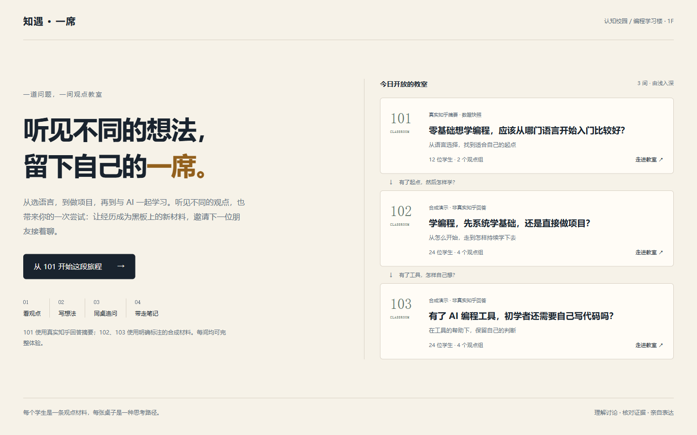
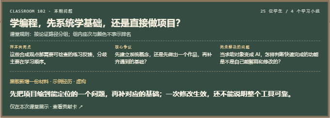

# 知遇·一席
## 产品说明计划书

**一道问题，一间教室；让一次经历，为讨论多补上一块拼图。**

知乎黑客松 2026 · 校园新锐季　｜　知识炼金场

团队：知乎有你一席　｜　队长：杨骐瑞　｜　湖北师范大学

**3 间完整教室 · 经验入席 · 黑板更新 · 分享邀请**

体验地址：https://zhiyu-yixi.vercel.app

浏览器直接打开，无需账号。可以先读观点，也可以带一段经历来。

版本：2026 年 9 月 15 日 · 经验入席参赛版（TASK-028）

---

# 01　让真实表达有一个入口

## 看过很多建议，仍不知道自己的经历该放在哪

面对“先学什么”“项目卡住怎么办”这类多元问题，学习者会读到许多建议，却难以分清建议背后的目标和条件。有时用户没有一个新观点，只有一次失败的尝试、一个尚未验证的办法或一个真实疑问。这些也值得进入讨论。

知遇·一席把同题材料组织为可探索的像素课堂：每位学生代表一条材料，桌组呈现相近论证路径。用户先核对别人为什么这样想，再讲述一次经历，让 AI 追问一个具体细节；经过本人核对，贡献卡成为黑板上的一份新材料。

## 三间教室，对应三个学习阶段

| 教室 | 材料范围 | 邀请用户带来的经历 |
|---|---|---|
| 101：选语言 | 12 条真实知乎摘要、2 组 | 选择第一门语言时，哪次尝试改变了打算？ |
| 102：做项目 | 24 条合成材料、4 组 | 项目卡住时，怎样判断继续试还是回头补基础？ |
| 103：用 AI | 24 条合成材料、4 组 | AI 做出东西后，在哪一步发现仍要亲自理解？ |

101 的摘要来自知乎官方接口；102/103 的材料与作者为明确标注的合成演示。真实与合成共 60 条，不能称为 60 条知乎回答。原材料分组不代表正确性、支持率或全体用户共识。

## 与知乎社区的连接

产品面向大学生与进入陌生领域的职场新人，帮助他们从阅读走向可核对的表达。101 提供知乎原问题出口；合成课堂提供相关问题搜索。公开回答由用户亲自完成，应用不代写完整知乎回答，不代用户发布。

---

# 02　从一次经历到一张贡献卡

| 阶段 | 用户操作 | 明确产出 |
|---|---|---|
| 讲经历 | 写事件、办法、结果；可选择明确虚构示例 | 三段原始材料，区分自述与示例 |
| 听追问 | AI 结合本班来源，只问一个具体细节 | 可核对的参考来源与一次追问 |
| 作回应 | 如实补充细节，也可说明尚不确定 | 保留本次实际回应 |
| 确认表述 | 对照原始材料，编辑摘要和适用边界 | AI 最初草稿与本人最终表述分别保留 |
| 黑板留席 | 本人主动确认 | 黑板新增一份材料，出现用户座位；可修改、撤回 |
| 邀请接力 | 下载贡献卡，复制邀请或保存邀请图 | 朋友进入同一教室，开始自己的体验 |

用户不需要证明观点新颖。亲历、补充条件、疑问和反例都可以参与。网络失败保留输入，可重试或明确选择“由我自己整理”；人工整理不会标成 AI 生成。

**本次实现的边界：** 贡献仅在当前课堂会话展示，不是公共数据库；刷新、切题或撤回后清除。自述未经独立核验，虚构示例在编辑后仍保留示例标记。原知乎材料、分组与历史资产不会被覆盖。

---

# 03　两条完整路径，一套证据边界

## 原有观点学习路径保持可用

看观点 → 听各组 → 写至少 50 字想法 → 比较相关性、笔记支持与当前样本覆盖 → 同桌追问 → 整理课堂笔记 → 留下一席 → 下载 / 进入下一题。

原来的 Candidate Seat 仍只表示“当前样本覆盖较少”，不等于观点新颖、正确或用户已掌握。经验入席是另一个参与入口，不需要先满足 Candidate 的条件。

## 服务端负责生成与引用核对

Next.js App Router 单体承载页面与 API；React、TypeScript 和 Zod 共用结构约束。浏览器不持有模型密钥。DeepSeek V4 Pro 通过 AI SDK 生成结构化结果，来源与用户输入均视为待分析材料，不能执行其中的指令。

追问阶段从本班学生材料中匹配参考来源；完成阶段使用实际回应整理草稿。模型仅选择已有 evidenceId，服务端验证来源归属、题目和资料版本。HMAC 签名将追问与原始输入绑定，避免把旧追问用于另一段经历。

## 可靠性来自可复现的执行边界

真实课堂为带版本、采集时间与校验和的只读 Snapshot。101 离线使用 512 维 BGE 向量与 Ward 聚类；102/103 使用明确编写的合成材料和分组。在线比较当前课堂的有限证据，不宣称实现全站检索或向量数据库。

客户端使用独立状态机、请求标识与取消；服务端有 25 秒截止与有限重试。错误保留输入，晚到结果不能覆盖取消后的状态。新的经历不回退为预设贡献卡；原有示例流程仍必须精确匹配。

这是受约束的 AI 工作流，尚无自主多工具循环、多 Agent、MCP、长期记忆或公共贡献存储。像素学生代表材料，不是独立 Agent。

---

# 04　让愿意交流的人找到下一席

## 分享的是邀请，不是默认公开的个人经历

每间教室有自己的邀请问句。复制邀请、保存邀请图、系统分享均由用户主动触发；默认内容只包含课堂主题、邀请语和公开教室地址，不包含经历、回应、贡献卡或签名 token。

朋友通过链接直接进入对应教室的经验入口。分享失败时仍可手动复制文字；取消分享不显示发送成功。应用不会自动发送消息，也不伪造用户、点赞或评论。

## 人气奖如何与这次改进关联

开发者手册将活动广场点赞量、使用量和评论量列为人气奖参考，并推荐接入知乎 OAuth。新的入口、贡献产物和邀请工具意在降低真实体验和交流的门槛；获奖与增长效果仍需由真实用户反馈验证。

当前未接入 OAuth，也没有作品专属展示页。页面保留真实活动广场入口，但不会把它叫作本作品点赞页。队长提交获得专属链接后，可在自己的邀请消息中一并提供，方便体验者留下真实评价。教室邀请不自动等于平台已计入使用量。

## 下一阶段可以验证什么

邀请少量真实同学完成体验，观察他们是否能讲清原始问题、核对草稿、找到下载和下一步；收集愿意公开的具体反馈。先验证表达是否被忠实保留，再考虑 OAuth、公共贡献库与用户可管理的长期记录。

后续公共黑板需要明确同意、持久化、删除与来源管理，不将当前会话演示包装为多人共享知识库。当前没有用户规模、转化率、学习提升或赛事奖项数据。

---

# 05　交付、复验与后续学习

## 可运行、可带走、可核对

线上 Demo：https://zhiyu-yixi.vercel.app

公开视频：https://zhiyu-yixi.vercel.app/demo.webm

参赛代码：https://github.com/yangqirui2020/Zhiyu/tree/task/TASK-028-experience-contribution

随包包含说明书、实际操作录屏、三教室截图、浏览器下载的贡献卡与课堂笔记、源码、验收报告和 SHA-256 校验清单。录屏中示例、人工整理与实际模型调用按画面标记区分，不能据此推断稳定延迟或模型质量统计。

## 验收关注完整行为

自动化覆盖来源合同、引用校验、签名、精确示例、错误恢复及贡献状态。浏览器验收覆盖三间教室、1440×900 / 1366×768 / 390×844、键盘与 Reduced Motion；检查确认前后、修改、撤回、重试、取消、切题、第二次操作、复制与下载。执行结果以随包最新验收报告为准。

Node.js 24 环境中解压源码并安装依赖即可运行。课堂材料已打包；原有精确示例需配置本机随机签名密钥。自己的输入调用模型需另配 DeepSeek 凭证；经验的人工整理路径不依赖模型。源码与材料不含实际密钥。

## 从项目走向 Agent 开发

首先讲清结构化输出、证据校验、请求状态、签名和失败恢复。再参考 nanobot 阅读模型与工具的循环、上下文组织和停止条件，实验只读证据检索工具。之后建立固定评测集，比较召回质量、引用有效性、延迟和成本，再决定是否引入框架、MCP 或可观测平台。

这些后续能力尚未实现，不写进既有成果。简历说明 AI 辅助开发与自己能独立解释的部分，不虚构获奖、用户量或效果。

**提交提醒：** 9 月 15 日 10:00（北京时间）截止。部署与打包不代表完成投稿；队长需核对材料、完成最终提交并保存回执。参赛身份及声明由队长按实际情况确认。
